# wave-hostel

The wave-hostel is a hotel employees application for managing bookings, rooms, and guests information.

## Try it out

**Try wave-hostel [here](https://wave-hostel.netlify.app/).**

To log-in please use credentials:

Login: **demo@example.com**

Password: **demo0987**

## **Technologies used**

JavaScript with React, React Query, styled-components, SupaBase.

## **Features**

**Dashboard:** The initial app screen is a dashboard showing important information for the last 7, 30, or 90 days. This includes a list of daily check-ins and check-outs, statistics on recent bookings, sales, check-ins, and occupancy rates, along with charts displaying total and extra sales and stay duration statistics.

**Booking Management:** The app provides a table view of all bookings, detailing arrival and departure dates, statuses, paid amounts, associated room and guest data. Booking statuses can be "unconfirmed," "checked in," or "checked out" and are filterable.

**Room Management:** A table view displays all rooms with photos, names, capacities, prices, and current discounts. Users can update, delete, or create new rooms, including uploading photos.

**User Management:** Employees can create new accounts within the app. Users can upload avatars and change their names and passwords.

**Additional Booking Data:** This includes the number of guests, nights, guest observations, breakfast bookings, and prices. Users can delete, check-in, or check out bookings as guests arrive.

**Payment Confirmation:** Users need to confirm payment on guest arrival, and guests can add breakfast for their stay upon check-in if not already done.

**Guest Data:** Required fields include full name, email, national ID, and a country flag for easy identification.

**Settings:** Users can define application-wide settings for breakfast prices, and limits on bookings such as the number of nights and guests per booking.

**Dark mode:** The app includes a dark mode for user convenience.

**Database Integration** : Utilize Supabase for reliable data storage and retrieval.

## Screenshots

Log-in:

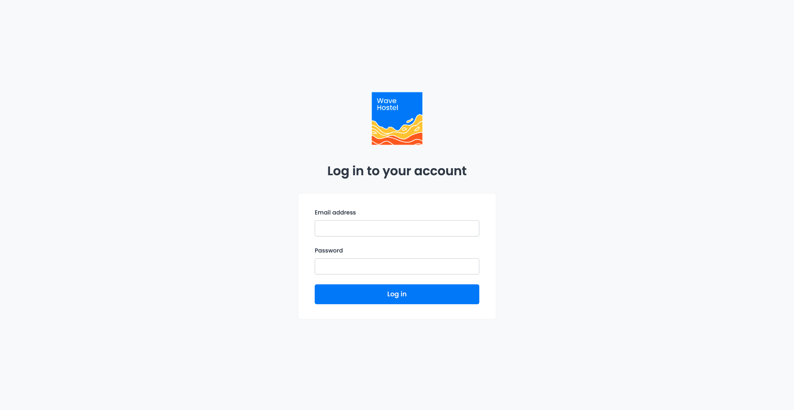

Dashboard:

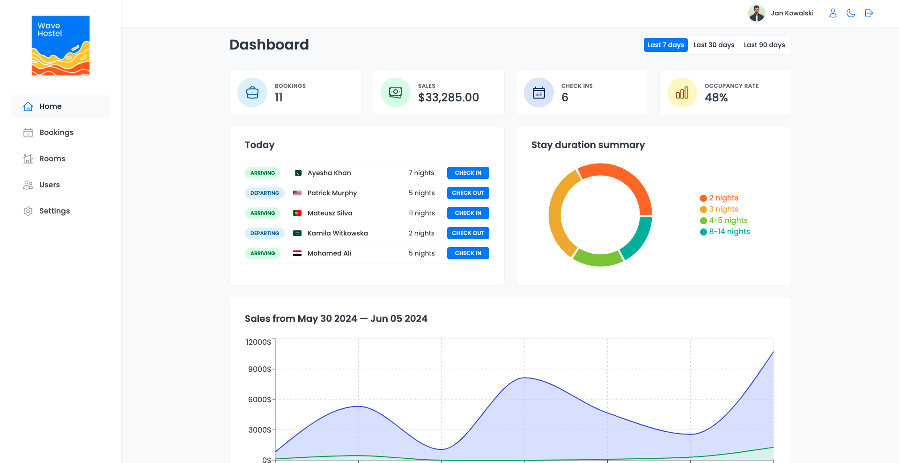

Bookings:

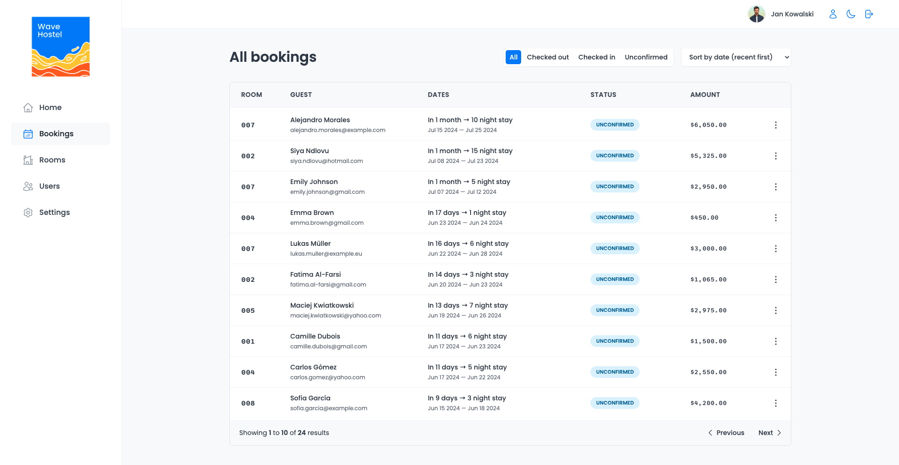

Rooms:

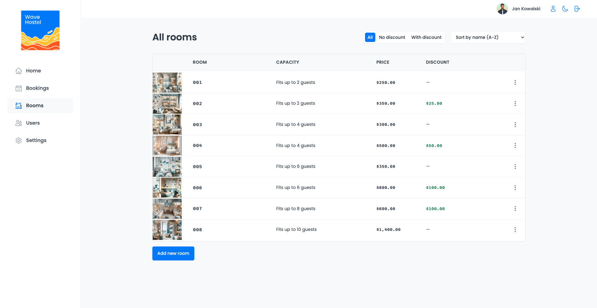

Add new room:

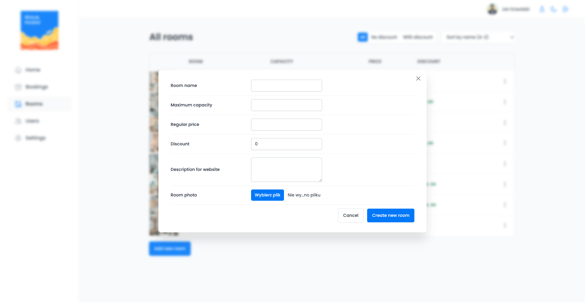

Booking details:

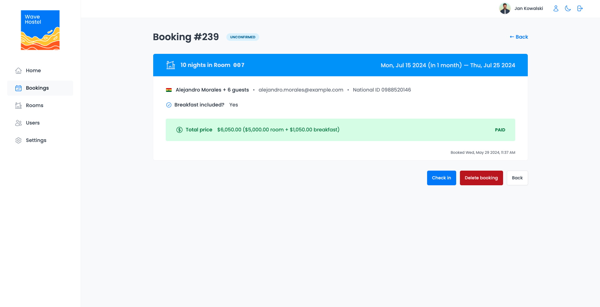

Booking check-in:

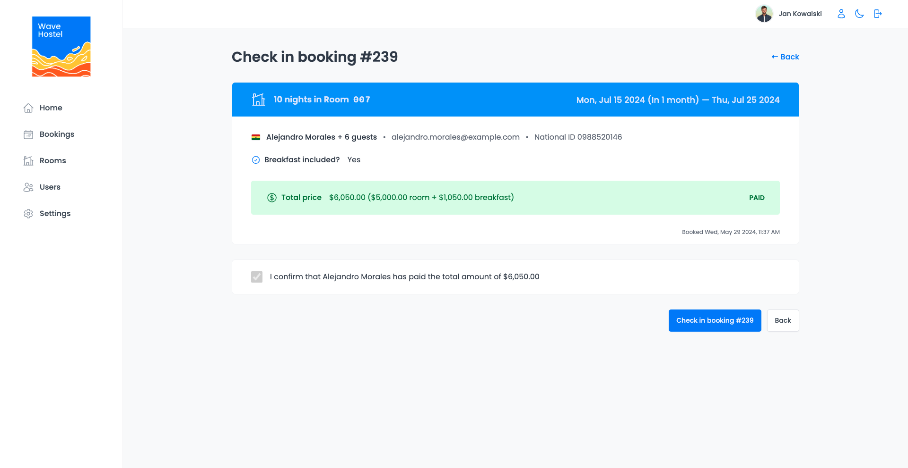

Create a new user:

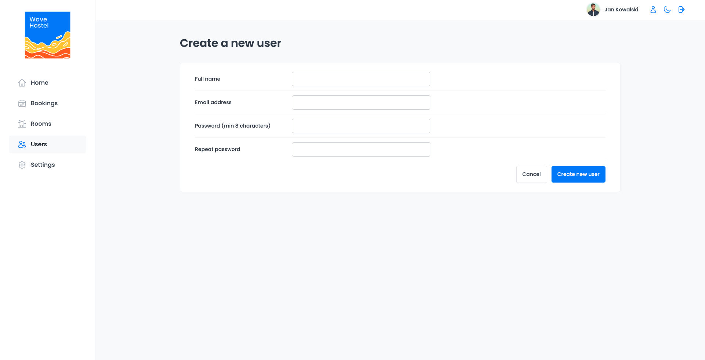

Settings:

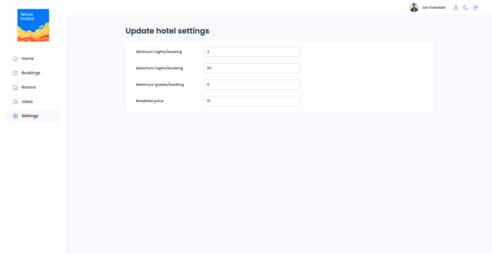

Account settings:

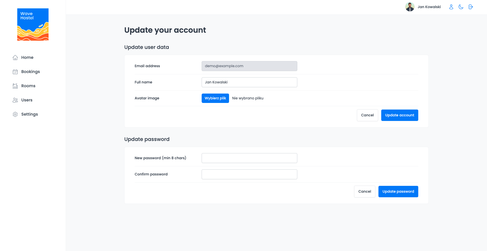

Dark mode:

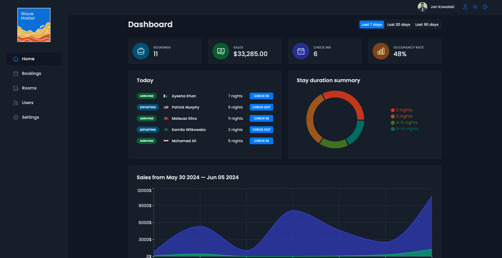
